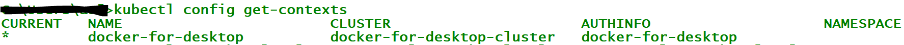

Kubernetes Workshop Overview
============================

This workshop's objective is to provide hello world experience of Kubernetes. After completion of this workshop, you should be:

- Familiar with kubectl commands
- Familiar with Kubernetes UI
- Deploy your applications into local kubernetes/ docker for windows
- Deploy your applications into aws clusters

Prerequisites
=============

In order to begin the workshop, you must have the following softwares installed in your machines.
- Chocolatey - the windows package manager [Chocolatey](https://chocolatey.org/install)
- run choco install docker-for-windows or [Docker Installation](https://docs.docker.com/docker-for-windows/install/)
- run docker --version, to verify installation.
- Enable kubernetes [Enabling Kubernetes](https://docs.docker.com/docker-for-windows/#kubernetes)
- run kubectl version, to verify installation.
- run kubectl config get-contexts

